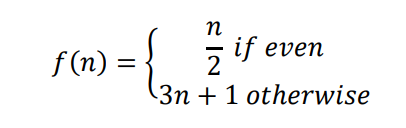

# Laboratory 2 : Collatz Conjecture

<strong>INTRODUCTION</strong>

The Collatz conjecture named after the 20th Century mathematician Lothar Collatz states that 

<strong>LEARNING OUTCOMES:</strong>
<ul>
<li>Implement an assembly code to generate count the Collatz sequence for a given integer.
</li>
<li>Store the result of the count to memory.</li>
</ul>

<strong>PROBLEM BACKGROUND</strong>

<li>Declare a word memory as input and another as storage for the output.</li>
<li>Count the Collatz cycles of your input value to terminate to 1.</li>
<li>Store the Collatz cycles to the memory location of your ouput</li>
