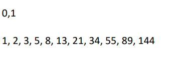
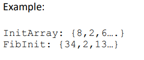

# Laboratory 3 : Fibonacci Initialization

<strong>INTRODUCTION</strong>

The Fibonacci sequence named after the 12th century mathematician Leonardo Fibonacci is
characterized by the sum of the two previous integers with seed values 0 and 1. For example

<strong>LEARNING OUTCOMES:</strong>
<ul>
<li>Implement an assembly code to generate a Fibonacci sequence.
</li>
<li>Initialize memory items with Fibonacci sequences.
</li>
</ul>

<strong>PROBLEM BACKGROUND</strong>

<li>Declare an array of 20 bytes on the data segment and initialize it with any value from 1-20. Name
this as <b>InitArray</b>.</li>
<li>Allocate another 20 words of memory on the data segment and name this <b>FibInit</b>.</li>
<li>Allocate another 20 words of memory on the data segment and name this <b>FibInit</b>.</li>
 
