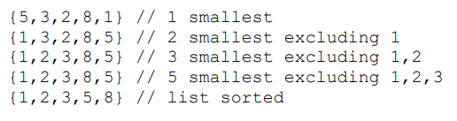

# Laboratory 4 : Selection Sort

<strong>INTRODUCTION</strong>

A general approach when we would manually sort items, is selection sort it is
accomplished by:
<li>Finding the smallest(or largest) item on the list.</li>
<li>Exchange this item with the top item of the unsorted part.</li>
<li>Repeat until all items are sorted.</li>

 
<strong>LEARNING OUTCOMES:</strong>
<ul>
<li>Implement an assembly code to implement get the minimum item on a list.
</li>
<li>Use the function of getting the minimum to implement selection sort.
</li>
</ul>

<strong>PROBLEM BACKGROUND</strong>

<li>Declare an array of 15 bytes on the data segment and initialize it with any value byte sized value.
Name this as <b>array</b>.
</li>
<li>Implement a procedure named <b>getMin</b> to get the minimum value on <b>array</b>.
</li>
<li>Call the procedure getMin on procedure <b>selectionSort</b> to sort array in ascending order</li>
 
